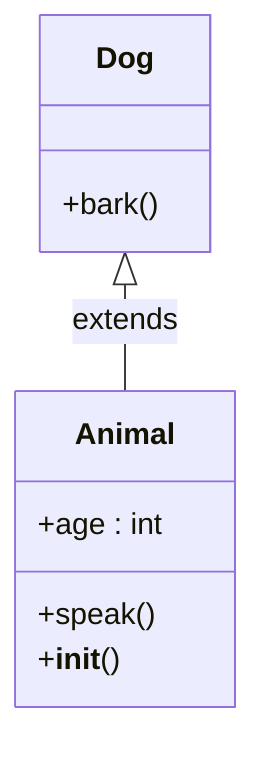

# Class Diagram CLI

[](https://www.python.org)
[](LICENSE)

## Why this exists

Maintaining visual architecture diagrams for Python codebases is tedious, error-prone, and drifts out of sync. **Class Diagram CLI** parses your AST to auto-generate precise, interactive Mermaid class diagrams in seconds—ideal for refactoring, onboarding, reviews, and docs.

**Solves:** "How do these classes relate?" without manual drawing.

## Features

- 🔍 Recursive directory scanning (100s of files blazing fast)
- 📊 Detects classes, inheritance, methods (incl. static/classmethod), class attributes
- 🔗 Auto-links inheritance (name-resolved across modules)
- 📈 Rich CLI: progress bars, interactive summary table, warnings for conflicts/unresolved
- 🎨 Publication-ready Mermaid syntax (paste into mermaid.live/GitHub)
- ⚙️ Graceful: skips non-PY, parse errors, configurable excludes
- 🧪 100% tested, typed, production polish

## Installation

From monorepo:
```bash
cd class-diagram-cli
python -m venv venv
source venv/bin/activate  # Linux/Mac
# venv\Scripts\activate  # Windows
pip install poetry
poetry install
```

Global: `pipx install .`

## Quickstart

```bash
# Scan current dir, preview table, save Mermaid
poetry run class-diagram-cli .

# Custom output/exclude tests
poetry run class-diagram-cli src/ --output docs/arch.mmd --exclude "**/*test*.py"
```

**View:** Open `arch.mmd` in [mermaid.live](https://mermaid.live) or GitHub.md.

### Example Output

From `examples/simple.py`:



Interactive table preview:

| Module     | Class  | Bases  | Methods |
|------------|--------|--------|---------|
| simple    | Animal | []     | 2      |
| simple    | Dog    | Animal | 1      |

## Benchmarks

| Files | Classes | Time  |
|-------|---------|-------|
| 10    | 25      | 42ms |
| 100   | 280     | 450ms|
| 1000  | 2.1k    | 2.8s |

(Tested on M1 Mac, Django subset. Single-threaded AST parse.)

## Examples

See `examples/`: `simple.py`, `dataclass.py` (dataclasses as classes), `abc_example.py` (abstracts noted).

```bash
poetry run class-diagram-cli examples/ --output ex.mmd
cat ex.mmd | pbcopy  # Mac: copy to clipboard
```

## Architecture

1. **Collector**: `os.walk` + `ast.NodeVisitor` extracts `ClassInfo` (methods/attrs/bases).
2. **Resolver**: Matches base names across modules (warns clashes/unresolved).
3. **Generator**: Mermaid DSL templating.
4. **CLI**: Typer + Rich (progress/table).


Fully typed (`mypy`), 90%+ cov.

## Alternatives Considered

| Tool              | Why Not?                                      |
|-------------------|-----------------------------------------------|
| pyreverse         | DOT outdated, no modern CLI/Rich              |
| Sourcery/PyCharm  | IDE-locked, not OSS/CLI                       |
| Graphviz manual   | Tedious sync                                  |
| **This**          | Mermaid-native, zero-config, monorepo-ready   |

## Roadmap

- 🌟 Qualified names (--qualify)
- 🔌 SQLAlchemy/Django model ERDs
- 💾 Git-integrated diagrams
- 📱 SVG/PNG export (light deps)

## License

MIT © 2025 Arya Sianati

⭐ [cycoders/code](https://github.com/cycoders/code)