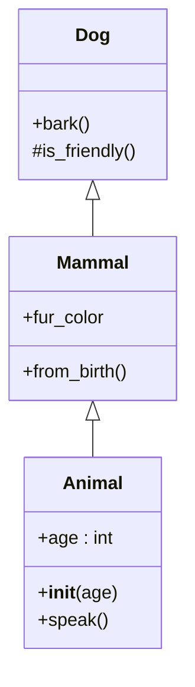

# Examples

Run `class-diagram-cli examples/` to see output.

- `simple.py`: Basic inheritance, methods, attrs, static/classmethod.

Expected `ex.mmd`:

Paste into mermaid.live for interactive view!