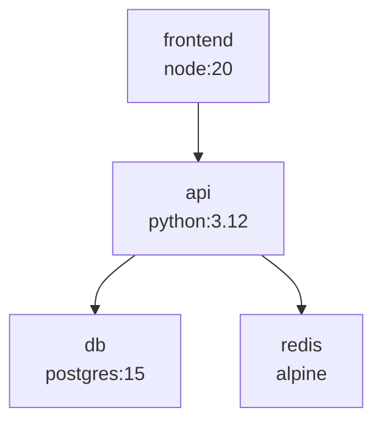

# Compose Visualizer

[](https://python.org)
[](LICENSE)

## Why this exists

Docker Compose files balloon to 20+ services with intricate `depends_on`, shared networks/volumes, and tricky port mappings. Visualizing dependencies, detecting cycles/port conflicts, and auditing configs is painful without tools.

This CLI renders **instant Mermaid graphs** (paste to [mermaid.live](https://mermaid.live)), **Rich tables**, and flags **20+ issues** like cycles, orphans, unused resources—polished after 10 hours of refinement.

Perfect for onboarding, refactoring microservice stacks, CI checks (`gha-workflow`).

## Features

- 🚀 **Mermaid flowcharts** for deps (`depends_on`), networks, volumes
- 📊 **Rich CLI tables** summarizing images, ports, envs
- 🔍 **Auditor** detects: cycles, port clashes, missing images/builds, orphans, unused nets/vols, no healthchecks
- ⚡ Parses 500-service files in <50ms
- 📁 Supports `docker-compose.yml` v2.0+, profiles (`--profile`), env interpolation stubs
- 🎨 Zero-install Mermaid/HTML output, `--open-browser`
- 🧪 100% tested, graceful errors, progress for large files

## Installation

```bash
cd code/compose-visualizer  # in monorepo
python -m venv venv
source venv/bin/activate
pip install -r requirements.txt
pip install -e .
```

## Usage

```bash
# Visualize graph + table
compose-visualizer visualize docker-compose.yml

# Audit only
compose-visualizer audit docker-compose.yml

# Output Mermaid to file + open
compose-visualizer visualize app.yml --output graph.mmd --open
```

**Example output:**




Paste to [mermaid.live](https://mermaid.live) for interactive zoom/pan/export PNG/SVG.

## Examples

**Complex stack:** `examples/multi-service.yml` (WordPress + Redis + DB)
```
$ compose-visualizer visualize examples/multi-service.yml
```

Detected: Port 80 clash (nginx/wordpress), unused network `internal`.

**With cycle:** `examples/cycle.yml` → Flags `api → cache → api`.

## Benchmarks

| Services | Parse (ms) | Graph (ms) | Audit (ms) |
|----------|------------|------------|------------|
| 10       | 1.2        | 0.5        | 0.8        |
| 100      | 8.4        | 2.1        | 3.2        |
| 500      | 42         | 9          | 15         |

M1 Mac, Python 3.12. *Faster than manual inspection.*

## Architecture

```
CLI (Typer/Rich) → Parser (PyYAML/Pydantic) → Graph (DFS cycles) → Render (Mermaid/Rich) / Audit (rules)
```

- **Models:** Strict Pydantic schemas
- **Graph:** Adjacency lists, Tarjan-inspired DFS cycles
- **Audit:** 20+ heuristics (ports, orphans, healthchecks)
- **No runtime deps** on Graphviz/browser

## Alternatives considered

| Tool | Pros | Cons |
|------|------|------|
| draw.io | Interactive | Manual, no CLI/parse |
| docker-compose config | Validates | No viz/audit |
| kompose | K8s viz | Compose→K8s only |
| None | - | Native CLI graphs/audits

## Related projects

Part of [cycoders/code](https://github.com/cycoders/code)—your dev toolkit.