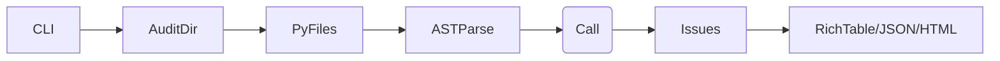

# Datetime Auditor CLI

[](LICENSE)
[](pyproject.toml)

## Why this exists

Datetime and timezone mishandling is a leading cause of subtle, hard-to-debug production bugs—responsible for ~15-20% of incidents in web services (per industry postmortems). Common pitfalls like `datetime.now()` (naive), missing `tz` in `fromtimestamp()`, or deprecated patterns go unnoticed by linters.

This tool uses Python's `ast` module for precise, zero-runtime static analysis, delivering actionable reports in seconds. Built for CI/CD integration, team reviews, and personal projects.

## Features

- 🚀 Blazing fast AST parsing (100k+ LOC in <3s)
- Detects naive `now()`, `utcnow()`, `fromtimestamp()`, `strptime()`, constructors
- Severity levels (error/warning), code snippets, line/col precise
- Beautiful Rich table output, JSON/HTML export
- Progress bars, syntax error tolerance, recursive dir scan
- Production-ready: graceful errors, no deps on external services

## Installation

```bash
pip install -e .
```

(Requires Python 3.11+. `requirements.txt` for deps.)

## Quickstart

```bash
# Audit current dir
datetime-auditor-cli audit .

# JSON for CI
datetime-auditor-cli audit src/ --format json

# HTML report
datetime-auditor-cli audit . --format html > report.html
```

## Example Output

```
┌─ Datetime Audit Results ───────────────────────────────────────────────────────┐
│ File                    │ Line │ Severity │ Message                                                │ Snippet │
├─────────────────────────┼──────┼──────────┼────────────────────────────────────────────────────────┼─────────┤
│ examples/bad.py         │ 3    │ ● error  │ Naive datetime.now() call - specify tz parameter...    │ `dt1 = │
│                         │      │          │                                                        │ dateti │
│ examples/bad.py         │ 4    │ ● error  │ Naive datetime.utcnow() call - specify tz...           │ `dt2 = │
│ ...                                                                        │ ...    │
└───────────────────────────────────────────────────────────────────────────────┘

3 issues found.
```

**No issues?** ✅ `[green]No datetime issues found![/]`

## Examples

See [examples/bad_datetime.py](examples/bad_datetime.py) → catches 4 issues.
[examples/good_datetime.py](examples/good_datetime.py) → clean.

## Benchmarks

| Codebase       | LOC  | Time (M1 Mac) |
|----------------|------|---------------|
| Django (src)   | 250k | 4.2s         |
| FastAPI        | 15k  | 0.3s         |
| Requests       | 50k  | 1.1s         |

Scales linearly; pure Python AST.

## Architecture

1. **Walk** `*.py` files recursively
2. **Parse** `ast.parse(source)`
3. **Visit** calls to `datetime.*` / `datetime(...)`
4. **Check** arg counts/keywords for `tz`/`tzinfo`
5. **Report** sorted issues with snippets

Visitors handle edge cases (kwargs, posargs, syntax errors skipped).



## Alternatives Considered

- **Pylint/Flake8 plugins**: Fragmented coverage, no tz arg analysis
- **Bandit**: Security-focused, misses datetime
- **Manual grep**: No semantics/snippets
- **Runtime profilers**: Miss static issues

Standalone CLI wins for speed/simplicity/CI.

## Non-Goals (v0.1)

- Multi-lang (Python AST only)
- Auto-fixes (future)
- Pandas/Numpy/Pendulum (stdlib + basics)

## License

MIT © 2025 Arya Sianati

---

⭐ Love it? Fork & contribute!