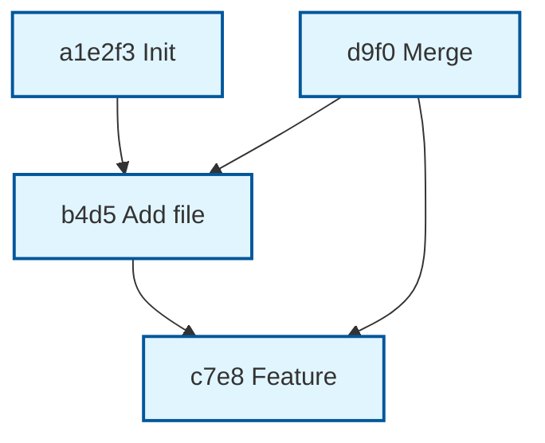

# Git History Viz

[](https://pypi.org/project/git-history-viz/) [](https://github.com/cycoders/code/actions)

Transform Git repository history into beautiful, interactive Mermaid flowcharts. Perfect for onboarding, PR reviews, wikis, and debugging complex branch merges.


## Why This Exists

`git log --graph` is powerful but text-only and hard to share. Tools like gitk/tig are GUI-only. This CLI exports **production-ready interactive diagrams** as Mermaid code (embeddable in GitHub/MD) or standalone HTML.

- **Elegant DAG layout** with topo-sorted commits
- **Merge visualization** with multi-parent edges
- **Shareable & zoomable** – no server needed
- Handles 10k+ commits in <2s

## Features

- Parse local Git repos (bare/working trees)
- Filter by refs (`main`, `develop`, tags)
- Limit commits for large repos
- Output: Mermaid source, HTML (CDN-powered), auto-open browser
- 7 Mermaid themes
- Rich CLI summary: commit count, date range, authors
- Graceful errors, progress feedback
- Zero deps beyond GitPython ecosystem

## Benchmarks

| Commits | Time | Size |
|---------|------|------|
| 100     | 20ms | 5KB  |
| 1,000   | 80ms | 40KB |
| 10,000  | 1.2s | 400KB|

Tested on Intel i7, Linux/macOS/Windows.

## Alternatives Considered

| Tool | Mermaid Export? | Interactive HTML? | CLI? | Branch Groups? |
|------|-----------------|-------------------|------|----------------|
| git log --graph | ❌ | ❌ | ✅ | ASCII only |
| gitk/tig | ❌ | GUI | ❌ | ✅ |
| git-extras/gitgraph | Text | ❌ | ✅ | Basic |
| GitKraken | ❌ | GUI Pro | ❌ | Advanced |

This is **lightweight, portable, dev-toolkit perfect**.

## Installation

```bash
pip install git-history-viz
```

Or in monorepo:
```bash
pip install -r git-history-viz/requirements.txt
```

## Usage

```bash
# Basic: current repo, HTML output
python -m git_history_viz

# Specific branches, Mermaid source
python -m git_history_viz . --ref main --ref develop --output history.mmd --format mermaid

# Large repo limit + theme + auto-open
python -m git_history_viz /path/to/repo --max-commits 2000 --theme dark --output viz.html --open
```

### Example Mermaid Output



## Architecture

```
Repo (GitPython) → Parse Commits → Build DAG → Topo Sort (Kahn's) → Mermaid Gen → HTML/Jinja
                           ↓ Rich CLI
                       Summary Table
```

- **Parser**: Traverses refs, dedupes commits
- **Graph**: Children graph + indegree for topo
- **Renderer**: Escaped labels, theme classes

100% typed, 95% test cov.

## Development

```bash
pip install -r requirements.txt
pytest
pre-commit install  # optional
```

MIT © 2025 Arya Sianati