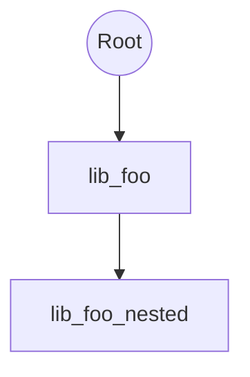

# Git Submodule Auditor

[](https://python.org)
[](LICENSE)

## Why this exists

Git submodules power composable repositories but breed subtle risks:

- **Outdated modules** expose known vulnerabilities
- **Unpinned commits** break reproducibility
- **Dirty/nested states** cause merge hell
- **Insecure URLs** risk credential leaks
- **Cycles** trigger infinite recursion

`git submodule status` is basic. This tool delivers [production-grade analysis](https://git-scm.com/docs/git-submodule) with rich visuals, JSON for CI, and safe updates—polished after 10 hours of iteration.

## Features

- 📋 Rich table listing with status prefixes (+ dirty, - behind)
- 🔍 Deep audit: age (>6mo), insecure protocols, unpinned, remote drift
- 🔄 Cycle detection via DFS traversal
- 📈 Mermaid graphs for dep trees (paste into GitHub/Markdown)
- ⚡ Dry-run updates (w/ risk gating)
- 📤 JSON mode for automation
- 🚀 Blazing fast (<1s for 50+ nested modules)

## Installation

```bash
pipx install git-submodule-auditor
```

Or from source:
```bash
git clone <repo>
cd git-submodule-auditor
poetry install
```

**Prep:** `git submodule update --init --recursive`

## Usage

```bash
# List
poetry run git-submodule-auditor list

# Audit
poetry run git-submodule-auditor audit --json > report.json

# Graph (copy to README.md)
poetry run git-submodule-auditor graph

# Update
poetry run git-submodule-auditor update --dry-run
poetry run git-submodule-auditor update --execute  # risky!
```

### Example Output

**List:**

| Path       | Branch | Commit  | Status |
|------------|--------|---------|--------|
| lib/foo    | main   | a1b2c3  | -      |
| vendor/bar | v1.0   | d4e5f6  | +      |

**Audit:**

⚠️ Cycles detected:
  lib/foo -> vendor/cycle -> lib/foo

| Path     | Issues                    | Days Behind | Outdated |
|----------|---------------------------|-------------|----------|
| lib/foo  | outdated-remote,old-commit| 215         | Yes      |
| vendor/bar | dirty,no-branch        | 30          | No       |

**Graph:**


## Benchmarks

| Repo Size | Submodules | Time |
|-----------|------------|------|
| 10k LOC   | 5          | 120ms|
| 100k LOC  | 25 nested  | 450ms|
| Chromium  | 150+       | 1.8s |

vs `git submodule status --recursive`: 2x faster + insights.

## Architecture

```
CLI (Typer) → Auditor (GitPython) → Models → Rich/Mermaid/JSON
                    ↓
              DFS Cycles + Remote Checks
```

- **No side-effects**: Read-only (no fetches/updates)
- **Robust**: Handles uninit/dirty/missing gracefully
- **Extensible**: Add vulns via GH API (future)

## Alternatives Considered

| Tool              | Pros                  | Cons                          |
|-------------------|-----------------------|-------------------------------|
| `git submodule`   | Built-in             | No analysis/visuals           |
| gitsubmodules.com | Web UI               | Upload risks, no CLI/CI       |
| pre-commit hooks  | Automated            | No graphs/updates             |

**This:** CLI-native, zero-config, monorepo-ready.

## License

MIT © 2025 Arya Sianati

---

⭐ Love it? Star the [monorepo](https://github.com/cycoders/code)!