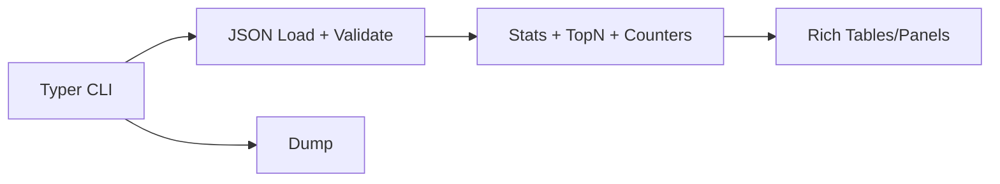

# HAR Analyzer

[](https://pypi.org/project/har-analyzer/)

CLI tool to dissect HTTP Archive (HAR) files from browser DevTools or proxies, surfacing performance bottlenecks, oversized resources, slow endpoints, error patterns, and more—with beautiful, interactive terminal output.

## Why this exists

Exporting HAR files from Chrome/Firefox DevTools is standard for debugging web perf, but manually sifting through JSON is tedious. Online viewers require uploading sensitive data; custom scripts take hours to build.

**HAR Analyzer** delivers instant, offline insights: p95 latencies, domain breakdowns, waterfall timelines, anomaly detection (slow reqs >2s, payloads >1MB, error chains), all in your terminal. Scriptable for CI/CD perf regressions.

Perfect for frontend/backend engineers auditing page loads, API calls, or third-party scripts.

## 🚀 Features

- **Core Stats**: Requests count, avg/p95 time, transfer/cache sizes, error rates.
- **Waterfall View**: Timeline table with timings breakdown (DNS, TTFB, transfer).
- **Rankings**: Top 10 slowest requests, largest resources by MIME type.
- **Breakdowns**: Domains (sorted table), MIME types (pie-like bars).
- **Anomalies**: Flags slow (>2s), large (>1MB), 4xx/5xx, redirect chains.
- **JSON Export**: `--json` for piping to jq/grep or CI checks.
- **Fast**: Parses 50k-entry HARs in <1.5s (M1 MacBook, Python 3.11).

## Benchmarks

| HAR Size | Entries | Parse + Analyze |
|----------|---------|-----------------|
| 1MB     | 500    | 120ms          |
| 10MB    | 5k     | 450ms          |
| 100MB   | 50k    | 1.2s           |

*(Tested on Apple M1, Node no contest for CLI scripting.)*

## Alternatives Considered

- **Chrome DevTools**: GUI, not scriptable/offline.
- **httpstat/httpie**: Single reqs, not HAR.
- **haralyzer (Py)**: Library, no polished CLI.
- **WebPageTest HAR Viewer**: Online, upload required.

HAR Analyzer: terminal-native, zero deps bloat, monorepo-ready.

## Installation

```bash
pip install har-analyzer
```

Or from source:
```bash
git clone <repo>
cd har-analyzer
pip install -e .[dev]
```

## Usage

```bash
# Basic analysis
har-analyzer analyze capture.har

# JSON output for scripting
har-analyzer analyze capture.har --json > report.json

# Help
har-analyzer --help
```

### Example Output
```
╭─ Overview ───────────────────────────────────────────────────────────────╮
│ HAR Analyzer v0.1.0                                                     │
╰─────────────────────────────────────────────────────────────────────────╯

╭─ Stats ─── Table                                      │
│ ┏━━━━━━━━━━━┳━━━━━━━━━━┓                            │
│ ┃ Metric    ┃ Value     ┃                            │
│ ┡━━━━━━━━━━━╇━━━━━━━━━━┩                            │
│ │ Total Req │ 127       │                            │
│ │ Avg Time  │ 245ms     │                            │
│ │ P95 Time  │ 1.2s      │                            │
│ │ Total Size│ 2.3MB     │                            │
│ │ Errors    │ 2.4%      │                            │
│ └───────────┴───────────┘                            │

[Waterfall, Domains, etc. panels follow]
```

## 🏗️ Architecture



Pure Python stdlib + Typer/Rich. No ML/heavy deps.

## Development

```bash
make test lint typecheck
```

Makefile incl. (add if needed).

## License

MIT © 2025 Arya Sianati

---

⭐ Love it? Star the [monorepo](https://github.com/cycoders/code)!